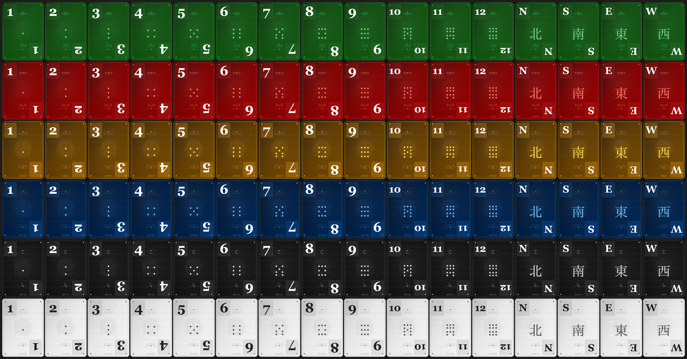

# Month Cycle Table

Month Cycle Table is a browser-playable, 4-player draw-and-discard card game built around a custom 96-card deck.

The deck contains 72 month cards and 24 wind cards. Month cards belong to a numbered month and one of six colors. Wind cards belong to one of four winds and one of six colors. Players draw to six cards, look for a valid scoring pattern, then discard back down while opponents can react with claims. The game blends quick tactical decisions with pattern-building, open-card commitment, wind bonuses, and a match structure built around changing round bonuses.



## Play

Play in the browser on GitHub Pages:

https://fernsugi.itch.io/month-cycle-table

Open `index.html` in a modern browser to play locally.

The current package is designed for itch.io as a static HTML game. No build step or server is required.

## What's Included

- `index.html`: the playable game
- `ai-tuner.js`: command-line AI self-play/tuning runner
- `RULES.md`: the full text rules
- `month_cycle_table_rulebook.pdf`: printable/reference rulebook
- `cover.png` and `gameplay.png`: itch.io page assets

## AI Tuning

Run a quick terminal tuning pass:

```sh
node ai-tuner.js --generations=2 --populationSize=8 --matchesPerGeneration=4 --roundsPerMatch=4
```

Run a longer pass and save the full JSON result:

```sh
node ai-tuner.js --generations=8 --populationSize=24 --matchesPerGeneration=32 --roundsPerMatch=8 --finalMatches=64 --out=ai-tuning-result.json
```

Use `--accurate` for slower, broader public-information evaluation after finding promising profiles.

## Rules

This README gives only a high-level overview. For complete turn flow, claims, scoring, gear requirements, and winning patterns, read `RULES.md` or the PDF rulebook.

## License

Released under Creative Commons Zero (CC0). You may use, copy, modify, or sell it without attribution.
